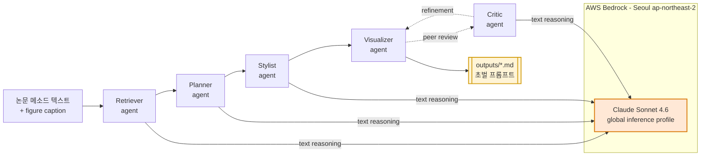

# PaperBanana-Bedrock

<p align="center">
  <strong>AWS Bedrock(Claude Sonnet 4.6, 서울 리전)로 동작하는 PaperBanana 포크</strong><br>
  <sub>실제 이미지 렌더링 대신 <em>사람이 검토 가능한 초벌 프롬프트 Markdown</em>을 생성합니다.</sub>
</p>

<p align="center">
  <a href="#빠른-시작"></a>
  <a href="#aws-bedrock-준비"></a>
  <a href="#테스트"></a>
  <a href="LICENSE"></a>
</p>

---

## 무엇이 바뀌었나요

[원본 PaperBanana](https://github.com/dwzhu-pku/PaperBanana)는 논문 메소드 텍스트와 캡션으로부터 학회(NeurIPS 등) 품질의 다이어그램·플롯 이미지를 자동 생성하는 멀티 에이전트 프레임워크입니다. 본 포크는 두 가지를 바꿨습니다.

| 구분 | 원본 | 본 포크 |
|---|---|---|
| 주요 LLM | Google Gemini (`gemini-3.1-pro-preview`) | **AWS Bedrock Claude Sonnet 4.6** (서울 리전) |
| 이미지 생성 | Gemini Nano-Banana (실제 이미지 PNG) | **Markdown 초벌 프롬프트**를 파일로 출력 (스텁) |
| 인터랙티브 UI | Streamlit(`demo.py`) + Gradio(`app.py`) | CLI만 유지 (`main.py`) |
| 의존성 | `google-genai`, `google-auth`, `streamlit`, `gradio`, `openai`, `anthropic` | `boto3`만 |

### 왜 이렇게 바꿨나요

1. **사내 보안·컴플라이언스**: AWS 계정 내부에서 완결되는 LLM 추론이 필요.
2. **프롬프트 리뷰 문화**: 모델이 이미지를 바로 렌더링하기 전에, 파이프라인이 만든 "초벌 프롬프트"를 사람이 먼저 읽고 검토하는 워크플로우가 실무적으로 더 안전함.
3. **결과물의 재사용성**: 생성된 Markdown은 나중에 다른 이미지 생성 모델(DALL·E, Flux 등)에 그대로 투입할 수 있는 규격화된 아티팩트가 됨.

---

## 아키텍처



- **텍스트 추론 에이전트 5종** (Retriever / Planner / Stylist / Critic / Vanilla baseline)은 Bedrock Claude Sonnet 4.6 호출.
- **Visualizer / Polish**는 원래 이미지 생성 API를 호출하던 지점에서, 대신 `utils/prompt_md_writer.py`가 YAML frontmatter + 메타데이터 + 프롬프트 본문이 포함된 `.md` 파일을 `outputs/`에 남김.

---

## 빠른 시작

### 요구사항

- Python 3.10+
- AWS 계정에서 **Claude Sonnet 4.6 모델 액세스가 활성화**된 서울 리전(`ap-northeast-2`) 자격증명
- AWS CLI v2 (권장)

### 설치

```bash
git clone https://github.com/hongvincent/paper-banana-bedrock.git
cd paper-banana-bedrock

python -m venv .venv
source .venv/bin/activate          # Windows: .venv\Scripts\activate
pip install -r requirements.txt

cp .env.example .env                # 편집해서 본인 프로파일/리전 입력
```

### 단일 호출 스모크 테스트

```bash
python - <<'PY'
import asyncio, os
from utils.generation_utils import call_model_with_retry_async

async def main():
    out = await call_model_with_retry_async(
        model_name=os.environ.get("BEDROCK_MODEL_ID", "global.anthropic.claude-sonnet-4-6"),
        contents=[{"type": "text", "text": "Reply with just: ok"}],
        config={"max_tokens": 20, "temperature": 0.0},
    )
    print("Bedrock:", out[0])

asyncio.run(main())
PY
```

성공 시 `Bedrock: ok`가 출력됩니다.

### 초벌 프롬프트 MD 생성 (스텁 파이프라인)

```bash
python - <<'PY'
from utils.prompt_md_writer import write_prompt_md

md_path, _ = write_prompt_md(
    prompt="세 개의 인코더와 하나의 디코더로 구성된 multi-modal transformer 아키텍처 다이어그램",
    metadata={"agent": "visualizer", "desc_key": "mm-transformer", "aspect_ratio": "16:9"},
    output_dir="./outputs",
)
print("wrote:", md_path)
PY
```

### 원샷: 기존 다이어그램을 개선한 프롬프트 MD 생성

이미 있는 흑백 아키텍처 드래프트를 AWS 브랜드 컬러가 드러나는 초벌 프롬프트로 바꾸고 싶을 때:

```bash
# 1) 설명을 텍스트 파일에 정리 (그룹·노드·연결 위주, 2~3단락이면 충분)
cat > my_diagram.txt <<'EOF'
5개 그룹으로 구성된 CRM 아키텍처. Group 1: MLOps (Step Functions → Macie →
Claude 4.6 → SageMaker Pipelines). Group 2: Network (WAF → API Gateway → Cognito).
...
EOF

# 2) 한 줄로 실행
python scripts/banana_prompt.py my_diagram.txt \
  --palette aws-brand --aspect 16:9

# 3) outputs/*.md 에 nano-banana 급 이미지 생성 프롬프트가 생성됨.
#    → 그대로 Nano Banana / DALL-E / Flux / Imagen 등에 투입
```

팔레트 옵션: `aws-brand` (기본), `neutral-editorial`, `paper-print`, 또는 프리폼 문자열.

### 전체 파이프라인

```bash
python main.py \
  --task_name diagram \
  --split_name test \
  --exp_mode dev_full \
  --main_model_name global.anthropic.claude-sonnet-4-6 \
  --image_gen_model_name stub.prompt-md-writer
```

---

## AWS Bedrock 준비

### 1. 서울 리전 + Cross-region Inference Profile

서울 리전(`ap-northeast-2`)에서 Claude Sonnet 4.6은 "글로벌" **cross-region inference profile**을 통해서만 호출됩니다. 모델 ID는 **`global.anthropic.claude-sonnet-4-6`**을 사용하세요.

직접 호출 가능한지 확인:

```bash
aws bedrock list-inference-profiles \
  --region ap-northeast-2 \
  --query "inferenceProfileSummaries[?contains(inferenceProfileName, 'Sonnet 4.6')].[inferenceProfileId,status]" \
  --output table
```

활성화된 프로파일이 없다면 AWS 콘솔 → Bedrock → Model access에서 `Claude Sonnet 4.6` 액세스를 신청하세요. 보통 분 단위로 승인됩니다.

### 2. 자격증명 설정 (3가지 중 택1)

**권장: 명명된 프로파일**

```ini
# ~/.aws/config
[profile my-bedrock]
region = ap-northeast-2

# ~/.aws/credentials  (본인 키로 채우세요)
[my-bedrock]
aws_access_key_id     = YOUR_ACCESS_KEY_ID
aws_secret_access_key = YOUR_SECRET_ACCESS_KEY
```

`.env`에 `AWS_PROFILE=my-bedrock` 지정.

**대안: 환경변수 직접**

```bash
export AWS_ACCESS_KEY_ID=...
export AWS_SECRET_ACCESS_KEY=...
export AWS_REGION=ap-northeast-2
```

**대안: AWS SSO**

```bash
aws sso login --profile my-bedrock
```

### 3. IAM 정책 최소 권한

```json
{
  "Version": "2012-10-17",
  "Statement": [{
    "Effect": "Allow",
    "Action": ["bedrock:InvokeModel", "bedrock:InvokeModelWithResponseStream"],
    "Resource": [
      "arn:aws:bedrock:*::foundation-model/anthropic.claude-sonnet-4-6*",
      "arn:aws:bedrock:*:*:inference-profile/global.anthropic.claude-sonnet-4-6*"
    ]
  }]
}
```

---

## 환경변수

| 변수 | 기본값 | 설명 |
|---|---|---|
| `AWS_REGION` | `ap-northeast-2` | Bedrock 호출 리전 |
| `AWS_PROFILE` | (없음) | 명명된 AWS 프로파일 |
| `BEDROCK_MODEL_ID` | `global.anthropic.claude-sonnet-4-6` | 추론 프로파일 ID |
| `BEDROCK_MAX_TOKENS` | `4096` | 응답 최대 토큰 |
| `BEDROCK_TEMPERATURE` | `0.7` | 샘플링 온도. 호출 시 `config`에서 덮어쓰기 가능 |
| `OUTPUT_DIR` | `./outputs` | 초벌 프롬프트 MD 저장 경로 |

---

## 출력 예시

`outputs/20260420T104215Z_visualizer_pipeline.md`:

```markdown
---
agent: visualizer
timestamp: 20260420T104215Z
aspect_ratio: 16:9
model: stub.prompt-md-writer
---

# Preliminary PaperBanana Prompt

## Metadata
| Key | Value |
|-----|-------|
| agent | visualizer |
| aspect_ratio | 16:9 |
| desc_key | pipeline |

## Prompt
```
세 개의 인코더와 하나의 디코더로 구성된 multi-modal transformer...
```

## Next Steps
이 프롬프트를 검토한 뒤, 원하는 이미지 생성 모델(DALL·E, Flux, Imagen 등)의
입력으로 사용하거나 수기로 다듬어 최종 도식을 만드세요.
```

---

## 테스트

```bash
pytest tests/ -v
```

- **28 tests, 0 failures** (Bedrock client 8 + generation_utils 14 + prompt_md_writer 6)
- 모든 테스트는 `boto3`를 목(mock)으로 스텁하며 실제 AWS 호출 없이 실행됩니다.
- 커버리지: 핵심 모듈(`bedrock_client.py`, `generation_utils.py`, `prompt_md_writer.py`) 80%+ 목표.

실 Bedrock 연동 검증은 `.env`를 설정한 뒤 위 "스모크 테스트" 스니펫으로 수동 1회 실행을 권장합니다.

---

## 프로젝트 구조

```
paper-banana-bedrock/
├── agents/                      # Retriever, Planner, Stylist, Critic, Visualizer,
│   │                            # Vanilla, Polish — 각 에이전트 구현
│   └── *.py
├── utils/
│   ├── bedrock_client.py        # boto3 wrapper, 재시도/백오프, BedrockInvocationError
│   ├── generation_utils.py      # call_model_with_retry_async 라우터
│   ├── prompt_md_writer.py      # 이미지 생성 스텁: 초벌 프롬프트 MD 출력
│   ├── eval_toolkits.py
│   ├── config.py
│   ├── paperviz_processor.py
│   └── image_utils.py
├── prompts/                     # 시스템 프롬프트 템플릿
├── style_guides/                # NeurIPS 2025 스타일 가이드 (.md)
├── configs/model_config.template.yaml
├── scripts/
│   ├── run_main.sh
│   └── security_scan.sh         # 커밋 전 시크릿 스캔
├── .githooks/pre-commit         # git hook (core.hooksPath=.githooks)
├── tests/                       # pytest 28개
├── main.py                      # CLI 엔트리포인트
├── Dockerfile                   # python:3.11-slim, ENTRYPOINT=main.py
├── requirements.txt
├── .env.example
├── LICENSE                      # Apache 2.0 (업스트림 승계)
├── NOTICE                       # 업스트림 Attribution + 변경 요약
└── README.md
```

---

## 보안

- `configs/model_config.yaml`, `.env`, `outputs/`, AWS credentials는 모두 `.gitignore`에 포함.
- `scripts/security_scan.sh`는 AKIA/ASIA 패턴, GitHub/OpenAI/Anthropic 토큰, 내부 경로를 커밋 전에 차단.
- `.githooks/pre-commit`이 이 스캔을 매 커밋마다 실행. 활성화:
  ```bash
  git config core.hooksPath .githooks
  ```
- AWS 계정 정보(account ID, ARN, IAM 사용자명)는 **어느 파일에도 하드코딩되지 않음**. 전부 환경변수 또는 본인 프로파일 경유.

---

## 트러블슈팅

| 증상 | 원인 / 조치 |
|---|---|
| `Unable to locate credentials` | AWS 자격증명 미설정. `aws configure --profile ...` 또는 `aws sso login`. |
| `AccessDeniedException: ... access denied to model` | Bedrock 콘솔에서 `Claude Sonnet 4.6` 모델 액세스 신청. |
| `ValidationException: ... temperature and top_p cannot both be specified` | 이미 `bedrock_client.py`에서 예방. 최신 커밋인지 확인. |
| `ThrottlingException` | 자동 지수 백오프로 3회까지 재시도. 반복되면 AWS Service Quotas 요청 상향. |
| `The model XXX is not supported` | `BEDROCK_MODEL_ID`가 `anthropic.`/`apac.anthropic.`/`global.anthropic.`/`us.anthropic.` 접두어인지 확인. |

---

## 비용 가이드 (대략)

| 모델 | 입력 ($/1M tok) | 출력 ($/1M tok) | 비고 |
|---|---|---|---|
| Claude Sonnet 4.6 (Bedrock) | ~$3 | ~$15 | 2026년 기준, 리전별 상이 |

파이프라인 1회 실행(4 텍스트 에이전트 × 평균 2k in / 1k out) ≈ **~$0.05–0.10**. 이미지 실제 렌더링이 없으므로 원본 대비 큰 폭으로 저렴합니다. 정확한 요금은 [AWS Bedrock Pricing](https://aws.amazon.com/bedrock/pricing/) 참조.

---

## 기여

- 이슈/PR 환영. 커밋 전 `bash scripts/security_scan.sh`와 `pytest tests/`가 모두 통과하는지 확인해 주세요.
- 새 기능은 TDD(테스트 먼저) 흐름을 유지해 주세요.

---

## 라이선스 & Attribution

본 프로젝트는 Apache License 2.0 하에 배포됩니다. [LICENSE](LICENSE) 참조.

원본 PaperBanana는 Google LLC의 Apache 2.0 오픈소스 저작물입니다. 본 포크에서 변경된 내용의 요약은 [NOTICE](NOTICE)에 정리되어 있습니다.

- 원본 리포지토리: https://github.com/dwzhu-pku/PaperBanana
- 원본 논문/블로그: 원본 리포지토리 참조

---

<sub>Made with Bedrock · 2026</sub>
